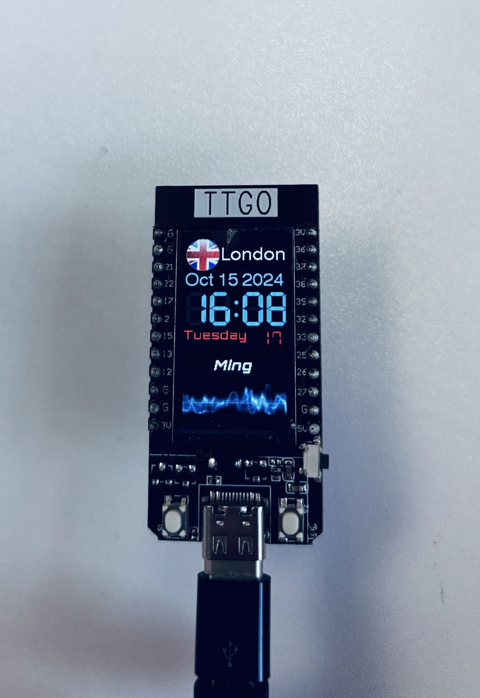

# ENGF0002- Challenge One  
This project about creating a programme in Arduino to display a clock on ESP 32 TTGO board.

## Features
- Animation
- The use of web fonts
- Get real-time information about the current city's tempereture, humidity and weather conditions, and switch display contents forth and back using left button (PIN 0).
  (Data source: by calling OpenWeather API)
  
## Project Showcase

